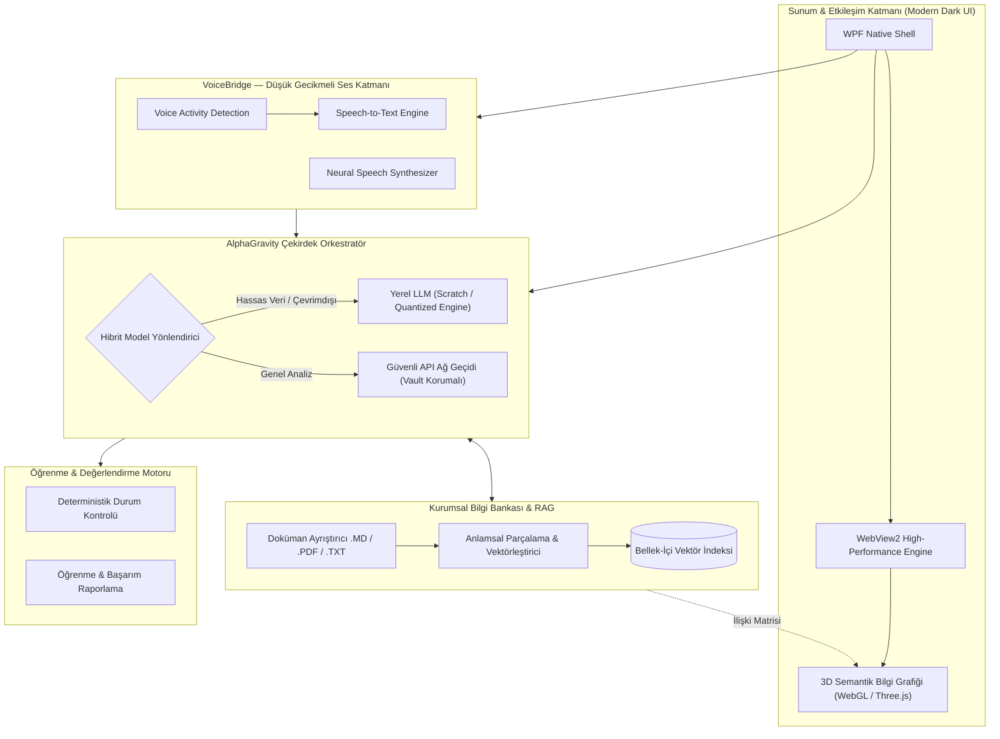

# 👋 Merhaba, Ben Alphan Kılıçaslan

  

  
  
  

---

## 👨‍💻 Mühendislik Yaklaşımım & Profilim

Yüksek performanslı masaüstü yazılımları, otonom yapay zeka aracı sistemleri (agentic architectures), düşük seviyeli ağ protokolleri ve finansal modelleme motorları tasarlayan bir yazılım mühendisiyim. 

Geliştirdiğim sistemlerin büyük bir bölümü kurumsal gizlilik (proprietary / enterprise IP) ve fikri mülkiyet koruması altında olduğu için kaynak kodları kapalı depolarda muhafaza edilmektedir. Aşağıda bu sistemlerin **mimari prensipleri, çözülen kritik mühendislik problemleri ve sistem tasarımları** özetlenmiştir.

---

## 🛠️ Yetkinlikler & Teknoloji Yığını

  

* **Diller & Çalışma Zamanları:** C# (.NET 8/9 / WPF), Python, C/C++, TypeScript, JavaScript, Lua.
* **Yapay Zeka & Agentic Sistemler:** Local LLM Inference (GGUF/Quantized), Multi-Model Routing (OpenAI / Anthropic / Gemini), RAG (Retrieval-Augmented Generation), Vector Databases, Prompt Engineering, Real-Time Speech Processing (VAD, TTS/STT).
* **Grafik & Görselleştirme:** WebGL, Three.js, WebView2 Entegrasyonu, Dinamik 3D Semantik Bilgi Çizgeleri (Knowledge Graphs).
* **Düşük Seviyeli Sistemler & Ağ:** Win32 API, Hardware Telemetry (RAM SPD, WMI, Disk Controller), WireGuard / Wiresock Network Tunneling, NAudio / ASIO Low-Latency Audio.
* **Finans & Analitik:** Kantitatif Portföy Simülasyonu, Monte Carlo Modellemesi, Dağıtık Durum Yönetimi.

---

## 🌟 Amiral Gemisi Projeler & Mimari Vaka Analizleri

> [!IMPORTANT]
> *Aşağıdaki projeler ticari ve kurumsal mülkiyet kapsamında geliştirilmiştir. Sistem bütünlüğünü ve fikri mülkiyeti korumak amacıyla kaynak kodları kamuya açık paylaşılmamakta; yalnızca mimari modelleri, işlevleri ve sistem akışları sergilenmektedir.*

---

### 🧠 1. AlphaGravity — Otonom Kurumsal Yapay Zeka & 3D Bilgi Zekası Platformu

  
  
  

**AlphaGravity**, işletmelerin ve araştırmacıların kurumsal verilerini harici bulut servislerine sızdırmadan; yerel veya hibrit dil modelleri (LLMs), ses köprüsü ve dinamik 3D semantik bilgi grafiği ile işleyen yeni nesil bir masaüstü yapay zeka işletim katmanıdır.

#### 🎯 Çözülen Problem
Geleneksel bulut tabanlı AI çözümleri, şirketlerin gizli ticari sırlarını, müşteri belgelerini ve iç prosedürlerini üçüncü taraf sunuculara göndermek zorunda bırakır. Ayrıca metin tabanlı sohbet arayüzleri, çok boyutlu kurumsal bilgi ilişkilerini (entity relationships) görselleştirmekte ve sesli gerçek zamanlı etkileşimde yetersiz kalır.

#### 🏗️ Sistem Mimarisi & Bileşenler

#### 🔬 Öne Çıkan Mühendislik Yetenekleri:
1. **İnteraktif 3D Bilgi Grafiği (3D Knowledge Topology):**
   * Yapay zekanın öğrendiği kavramlar, dokümanlar ve varlıklar arasındaki anlamsal ilişkiler, WebGL tabanlı dinamik 3 boyutlu bir çizge olarak gerçek zamanlı simüle edilir.
   * Düğümler (nodes) anlamsal yakınlığa göre fizik motoru (force-directed graph) ile konumlanır; kullanıcı çizge içinde gezinebilir.
2. **VoiceBridge Gerçek Zamanlı Ses Hattı:**
   * Kullanıcının sesini donanım seviyesinde yakalayıp VAD (Voice Activity Detection) filtresinden geçiren, ardından yapay zekanın yanıtını anlık nöral ses sentezi ile geri ileten düşük gecikmeli çift yönlü ses köprüsü.
3. **Hibrit / Çevrimdışı Model Altyapısı (Air-Gapped AI):**
   * İnternet bağlantısı olmayan tamamen izole (air-gapped) ortamlarda yerel model motoru üzerinden çalışabilme kabiliyeti.
4. **Sıfır Bilgi Güvenlik Kasası (Zero-Knowledge Key Vault):**
   * Hassas API anahtarları ve şirket parametreleri yerel donanım kimliğine bağlı kriptografik şifreleme ile saklanır; üçüncü taraf sunuculara telemetri gönderilmez.
5. **Deterministik Kontrol Noktaları (Checkpoint & Rollback):**
   * Tüm bilgi tabanı ve çalışma durumu tek tıkla geri yüklenebilir durum anlık görüntüleri (snapshots) ile korunur.

---

### 📈 2. AlpFinans — Kantitatif Finansal Zeka & Portföy Simülasyon Motoru

  
  

**AlpFinans**, kurumsal ve kişisel finansal varlıkların yönetimi, nakit akışı tahmini ve senaryo bazlı simülasyonlar gerçekleştirmek için geliştirilmiş yüksek hassasiyetli bir finansal zeka sistemidir.

#### 🎯 Çözülen Problem
Geleneksel finans yazılımları yalnızca geçmiş hareketleri listeler; geleceğe yönelik enflasyon, kur dalgalanması veya beklenmedik harcama senaryolarında nakit tükenme (runway) riskini öngöremez.

#### 🏗️ Temel Yetenekler:
* **Monte Carlo Finansal Simülatör:** Belirlenen parametreler ve volatilite aralıkları altında 10.000+ olası piyasa senaryosunu saniyeler içinde simüle ederek portföy risk dağılımını hesaplar.
* **Gider/Gelir Kümeleme & Anomali Tespiti:** Nakit akışındaki periyodik ve sapan harcamaları otomatik ayrıştıran algoritmik yapı.
* **Yerel Şifreli Veri Depolama:** Hassas finansal verilerin hiçbir bulut sağlayıcısına iletilmeden, yerel SQLite/şifreli veri katmanında tutulması.

---

### 🌐 3. AlpNet & AlpNet Pulse — Düşük Seviyeli Sistem Telemetrisi & Ağ Altyapısı

  
  

**AlpNet / AlpNet Pulse**, sistem kaynaklarını, ağ trafiğini ve düşük seviyeli donanım telemetrisini gerçek zamanlı izleyen, güvenli tünelleme ve ses iletim altyapısı sunan bir sistem mühendisliği aracıdır.

#### 🏗️ Temel Yetenekler:
* **Donanım Düzeyi Teşhis & Telemetri:** WMI ve Win32 düşük seviyeli kütüphaneler aracılığıyla RAM SPD yapılandırması, disk denetleyicileri ve CPU durumunu donanım katmanında okuma.
* **Gelişmiş Ağ Tünelleme (Wiresock / WireGuard Entegrasyonu):** Ağ paketlerini uygulama bazında filtreleyen, şifreleyen ve özel sanal adaptörler üzerinden yönlendiren SplitWire mimarisi.
* **Ultra Düşük Gecikmeli Ses Akış Hattı:** NAudio / ASIO sürücüleri ile mikrofon ve sanal kablo (VBCable) kanalları arasında gerçek zamanlı ses yönlendirme ve canlı dil çeviri modülü entegrasyonu.
* **Donanıma Kilitli Lisanslama Mimarisi:** Makine donanım izine (hardware fingerprint) dayalı kriptografik anahtar doğrulama sistemi.

---

## 📊 GitHub İstatistikleri & Süreklilik

  
   
  

  

---

  "Gerçek mühendislik gücü; kodları ifşa etmekte değil, karmaşık sistemleri kusursuz mimarilerle inşa edebilmektedir."

