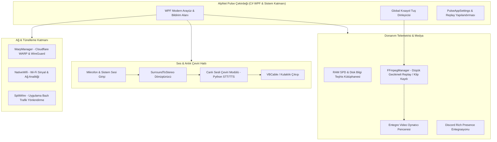
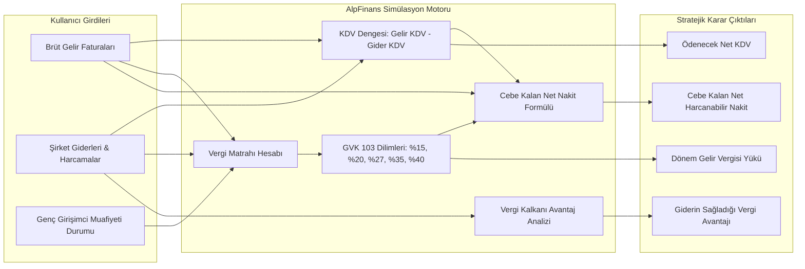
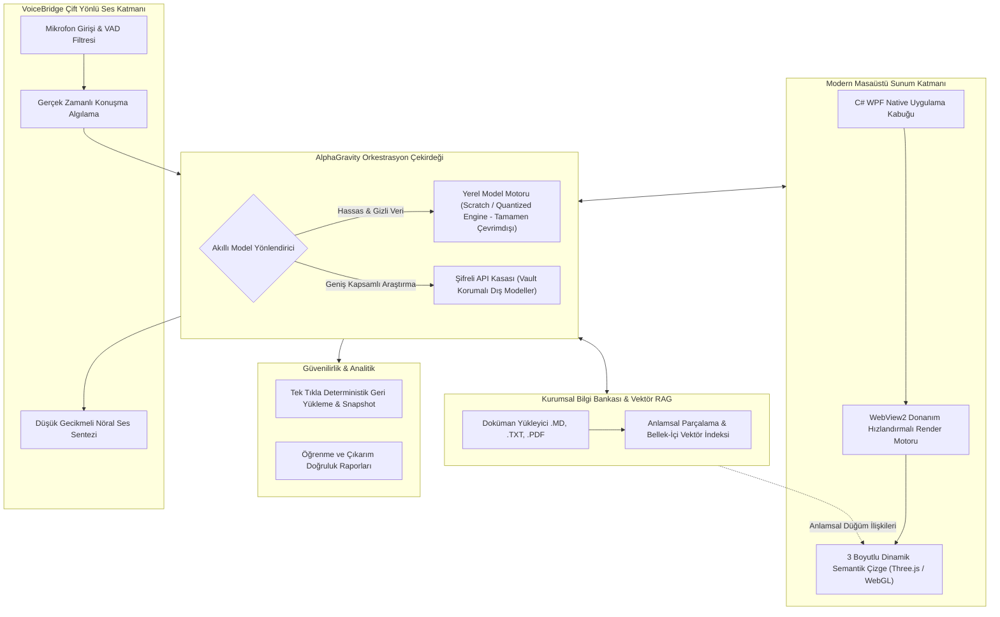

# 👋 Merhaba, Ben Alphan Kılıçaslan

  

  
  
  

---

## 👨‍💻 Programcılık Vizyonum & Yaklaşımım

Ben pratik, sahada çalışan, donanımın ve işletim sisteminin dilinden anlayan bir **Bilgisayar Programcısıyım**.

Geliştirdiğim projelerde teorik yaklaşımlardan ziyade; **doğrudan performansa odaklanan, düşük seviyeli API'leri (Win32, ASIO, WMI, Donanım sürücüleri) kullanan, otonom yapay zeka aracı modelleri geliştiren ve gerçek hayat problemlerine çözüm üreten** yazılımlar inşa ediyorum.

Projelerimin büyük çoğunluğu tescilli yazılımlar ve fikri mülkiyet (IP) korumalı masaüstü sistemleri olduğu için kaynak kodları kapalı tutulmaktadır. Aşağıda bu sistemlerin **derinlemesine çalışma mantığı, özellikleri ve mimari yapıları** yer almaktadır.

---

## 🛠️ Yetkinlikler & Teknoloji Yığını

  

* **Diller & Ortamlar:** C# (.NET Core / WPF), Python, C/C++, TypeScript, JavaScript, Lua.
* **Masaüstü & Sistem Programlama:** Windows Presentation Foundation (WPF), Win32 API, WebView2 (Modern Web Entegrasyonu), FFmpeg Interop, NAudio / ASIO.
* **Ağ & Donanım Entegrasyonu:** Cloudflare WARP & WireGuard Tünelleme, Native Wi-Fi API, Donanım Telemetrisi (RAM SPD, WMI, Sürücü Analizi), Sanal Ses Kabloları (VBCable).
* **Yapay Zeka & Agentic Sistemler:** Yerel Model Çalıştırma (Quantized / Local LLM), Çoklu Model Orkestrasyonu, Vektör RAG Bilgi Bankası, Gerçek Zamanlı Ses Köprüsü (VoiceBridge), 3D Semantik Çizge Görselleştirme.
* **Finansal Modelleme:** GVK 103 Vergi Matrah Simülasyonu, KDV Mahsuplaşma Algoritmaları, Dinamik Nakit Akış Tahmini.

---

## 🌟 Öne Çıkan Projeler & Kapsamlı Sistem İncelemeleri

---

### 🌐 1. AlpNet & AlpNet Pulse — Gelişmiş Ağ Tünelleme, Gerçek Zamanlı Ses Çevirisi & Donanım Telemetrisi

  
  
  
  

**AlpNet Pulse**, oyuncular, canlı yayıncılar ve ileri düzey bilgisayar kullanıcıları için geliştirilmiş çok fonksiyonlu bir sistem merkezidir. Yalnızca standart bir teleometri aracı değil; ağ tünelleme, anlık sesli çeviri, anlık oyun klibi yakalama ve donanım kontrolünü tek çatı altında birleştiren entegre bir masaüstü yazılımıdır.

#### 🔍 AlpNet Pulse'ın Çözdüğü Problemler ve Özellikleri:
1. **Akıllı Ağ Yönlendirme & WARP Tünelleme (WarpManager & SplitWire):**
   * İnternet trafiğini optimize eden, sansür ve rota gecikmelerini aşmak için Cloudflare WARP ve WireGuard tünellerini masaüstünden tek tıkla başlatan ve yöneten tünelleme entegrasyonu.
   * `NativeWifi` modülüyle çevre Wi-Fi ağlarını donanım seviyesinde tarama ve sinyal kalitesini haritalandırma.
2. **Canlı İki Yönlü Ses İşleme & Anlık Çeviri (VoiceTranslation Pipeline):**
   * Oyun veya görüşmeler sırasında gelen yabancı sesleri mikrofon/kulaklık düzeyinde yakalayan, düşük gecikmeli Python çeviri motoruna ileten ve çeviriyi kullanıcıya doğrudan nöral sesle dinleten tam entegre ses köprüsü.
   * Çok kanallı surround sesleri bozulma olmadan stereo kulaklıklara indirgeyen `SurroundToStereoProvider` ses matrisi.
3. **Sistem Kaynaklarını Yormayan Arka Plan Replay / Klip Motoru (FFmpegManager):**
   * GPU hızlandırmalı FFmpeg motoru sayesinde oyunda veya ekranda yaşanan son saniyeleri (Instant Replay) sistem performansını düşürmeden RAM/Disk tamponunda tutma ve global kısayol tuşuyla anında klip olarak kaydetme.
   * Kaydedilen klipleri doğrudan uygulama içindeki özel video oynatıcıda (`VideoPlayerWindow`) inceleme imkanı.
4. **Düşük Seviyeli Donanım Teşhis Kütüphanesi:**
   * WMI, RAM SPD (Timing & Bellek çipi üretici bilgileri) ve Disk denetleyicisi seviyesinde donanım okuma.
5. **Güvenlik, Lisanslama & Obfuscation:**
   * Donanım parmak izine (HWID) kilitli lisans doğrulama sistemi (`AlpNet.Keygen`), MSI yükleyicisi ve `Obfuscar` ile tersine mühendisliğe karşı korunan binary mimarisi.

---

### 💰 2. AlpFinans — Gelir/Gider Analitiği, GVK 103 Vergi Simülatörü & Net Kâr Hesaplayıcı

  
  
  
  

**AlpFinans**, şahıs şirketleri, serbest çalışan programcılar ve KOBİ'ler için geliştirilmiş; yalnızca geçmiş harcamaları tutmakla kalmayıp Türkiye Vergi Mevzuatına göre **gelecekteki vergi yükünü ve gerçek net kârı kuruşu kuruşuna hesaplayan** gelişmiş bir finansal karar destek sistemidir.

#### 🔍 AlpFinans'ın Çözdüğü Problemler ve Özellikleri:
1. **"Ay Sonunda Cebime Ne Kalacak?" Sorusuna Kesin Yanıt:**
   * Birçok yazılımcı ve işletme brüt ciro ile eline geçen parayı karıştırır. AlpFinans; KDV'yi, gelir vergisi dilimlerini ve işletme giderlerini birbirinden ayrıştırarak kullanıcının şahsi cebine kalan net harcanabilir tutarı net olarak raporlar.
2. **Gerçek Zamanlı GVK 103 Gelir Vergisi Dilim Simülatörü:**
   * Kazanç arttıkça %15'ten başlayıp %20, %27, %35 ve %40 dilimlerine geçen kademeli gelir vergisi baremlerini anlık simüle eder. Fatura kesilmeden önce vergi dilimi atlamasının maliyetini gösterir.
3. **Genç Girişimci İstisnası Desteği:**
   * Mevzuatta yer alan genç girişimci matrah muafiyetini (230.000 TL) tek tıkla hesaba katarak yeni girişimcilerin gerçek nakit akışını planlamasını sağlar.
4. **Vergi Kalkanı (Tax Shield) Analitiği:**
   * Yapılan bir giderin (örneğin donanım, ofis ya da yazılım aboneliği) şirkete sağladığı KDV mahsubu ve gelir vergisi indirim avantajını hesaplayarak harcamanın gerçek maliyetini ortaya koyar.
5. **Sıfır Bulut Bağımlılığı & %100 Finansal Gizlilik:**
   * Şirketin ve geliştiricinin hassas finansal tabloları kesinlikle üçüncü taraf bulut veritabanlarına gönderilmez; tamamen yerel cihazda şifreli veri tabanında tutulur.

---

### 🧠 3. AlphaGravity — Otonom Kurumsal Yapay Zeka & 3D Bilgi Zekası Platformu

  
  
  
  

**AlphaGravity**, işletmelerin ve bağımsız araştırmacıların hassas verilerini dış dünyadan tamamen izole ederek işleyen, yerel LLM inference motorunu, iki yönlü sesli asistanı ve 3 boyutlu interaktif bilgi haritasını bir araya getiren amiral gemisi masaüstü yapay zeka istasyonudur.

#### 🔬 AlphaGravity'nin Öne Çıkan Mimari Yetenekleri:
1. **Dinamik 3D Semantik Bilgi Çizgesi (3D Neural Topology):**
   * Yapay zekanın öğrendiği kavramlar ve dökümanlar arasındaki anlamsal ilişkiler, WebGL ve Three.js tabanlı canlı bir 3 boyutlu grafikte fizik motoruyla canlandırılır. Kullanıcı düğümler arasında gezinebilir, kavram kümelerini görsel olarak keşfedebilir.
2. **VoiceBridge — Gerçek Zamanlı Ses Köprüsü:**
   * Tuşlara basmadan, konuşma bittiği anı algılayan VAD (Voice Activity Detection) algoritmalarıyla yapay zekaya sesli girdi sağlayan ve yanıtı anlık nöral ses senteziyle geri seslendiren düşük gecikmeli döngü.
3. **İzole / Çevrimdışı Çalışma (Air-Gapped Modu):**
   * Gizli şirket verilerinin internete sızmasını engellemek amacıyla tamamen yerel donanımda çalışan modeller ile sıfır veri sızıntısı garantisi.
4. **Kriptografik Güvenlik Kasası (Local Secret Vault):**
   * Harici servis anahtarları işletim sisteminin kriptografik API'leri kullanılarak şifrelenir; telemetri veya log kaydı dışarı aktarılmaz.
5. **Kararlı Kontrol Noktaları (Checkpoint & Rollback Mimarisi):**
   * Bilgi tabanı üzerinde yapılan tüm güncellemeler ve model hafızası anlık olarak snapshot'lanabilir; tek tıkla eski kararlı duruma (`GERI_YUKLE_CHECKPOINT`) dönülebilir.

---

## 📊 GitHub İstatistikleri & Süreklilik

  
   
  

  

---

  <i>"Bir bilgisayar programcısının asıl gücü; teoride kalmayıp çalışan, hızlı ve gerçek problemleri çözen sistemler inşa edebilmesidir."</i>

